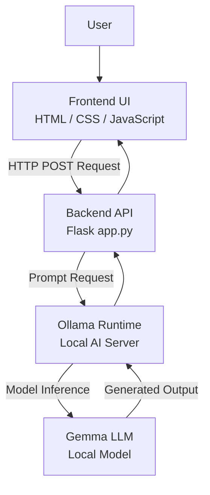

# StudyPilot AI
Your Smart AI Learning Assistant


---

## 📘 Project Overview

StudyPilot AI is an AI-powered learning assistant designed to support students in understanding academic concepts, assessing their knowledge, and improving exam preparation across multiple subjects.

Instead of functioning as a simple question–answer chatbot, StudyPilot AI guides learners through a structured learning workflow that includes concept explanation, self-testing, delayed feedback, and targeted study advice. The system is intentionally designed to reflect real educational and revision practices rather than instant-answer interactions.

---

## 🎯 Target Users & Learning Assumption

StudyPilot AI is designed with a clear learner assumption:

**The system assumes the user is a student preparing for assessments or examinations at secondary, pre-university, or diploma level.**

This learner assumption is embedded directly into the backend AI logic and influences:
- The tone and depth of explanations
- The structure and difficulty of quiz questions
- The timing of feedback delivery
- The nature of study advice provided

All outputs prioritise exam-relevant understanding rather than casual discussion.

---

## ❓ Problem Statement

Many students struggle with:
- Understanding abstract or unfamiliar academic concepts
- Identifying gaps in their own knowledge
- Practicing effective self-assessment
- Receiving meaningful feedback after quizzes
- Structuring efficient exam revision strategies

Most AI tools provide instant answers but do not support a complete learning cycle. StudyPilot AI addresses this gap by integrating AI into a structured educational workflow that encourages active learning and reflection.

---

## ✅ Core Features

### 1. Explain Concept (AI as Tutor)
- Explains academic topics across multiple subjects
- Tailors explanations for exam-oriented learning
- Responds using the same language as the user’s input

### 2. Generate Quiz (AI as Assessor)
- Generates assessment-style multiple-choice questions
- Focuses on testing conceptual understanding
- Answers are intentionally hidden to encourage self-attempt
- Variation logic reduces repeated quiz generation

### 3. Reveal Answers (Delayed Feedback)
- Answers are revealed only after a quiz is generated
- Provides correct answers with concise explanations
- Encourages active recall before feedback

### 4. Study Tips (AI as Study Coach)
- Identifies key concepts to revise
- Highlights common exam-related mistakes
- Suggests practical and effective revision strategies

---

## 🧠 Educational Design Principles

StudyPilot AI is designed around established learning principles:

* **Active Recall**: Learners attempt quiz questions before seeing correct answers.
* **Delayed Feedback**: Separating quiz attempts from answer explanations improves retention.
* **Learning Stage Awareness**: The AI dynamically switches roles depending on learning stage:
  * *Tutor* for explanation
  * *Assessor* for testing
  * *Study Coach* for revision guidance

---

## 🏗 System Architecture

StudyPilot AI follows a client–server architecture with a locally hosted AI model.

### High-Level Architecture Overview

`User` ↓ `Frontend (HTML / CSS / JavaScript)` ↓ `Backend API (Flask – app.py)` ↓ `Local AI Runtime (Ollama)` ↓ `Large Language Model (Gemma)`

### Architecture Diagram



This diagram represents a closed-loop system architecture where all AI processing is performed locally. The frontend manages user interaction, the backend enforces learning logic, and the AI runtime handles content generation.

---

## 🔧 Component-Level Architecture

### Frontend (HTML / CSS / JavaScript)

The frontend is responsible for user interaction and presentation. Its responsibilities include:

- Capturing user input such as topic selection and learning mode  
- Displaying AI-generated explanations, quizzes, and study tips  
- Rendering multiple-choice quiz questions with selectable options  
- Providing navigation between learning stages  

The frontend contains **no AI logic**, ensuring a clear separation of concerns.

---

### Backend API (Flask – app.py)

The Flask backend serves as the core control layer of the system. It is responsible for:

- Receiving and validating requests from the frontend  
- Enforcing the learning workflow (Explain → Quiz → Reveal → Study)  
- Managing temporary state such as the current topic and quiz context  
- Constructing role-based AI prompts  
- Preventing invalid actions (e.g. revealing answers without a quiz)  

By centralising logic in the backend, consistency in learning behaviour is maintained.

---

### Ollama Runtime

Ollama functions as the local AI runtime responsible for executing AI prompts. It:

- Receives prompt instructions from the backend  
- Performs model inference locally  
- Requires no internet connectivity or external API keys  

---

### Gemma Large Language Model

Gemma is the Large Language Model used by StudyPilot AI. It is responsible for:

- Generating concept explanations  
- Creating assessment-style quiz questions  
- Producing delayed feedback for answer revelation  
- Providing study tips and revision strategies  

The model operates entirely on the local machine, ensuring **privacy, security, and independence** from cloud-based AI services.

---

## 🔄 Detailed Execution Flow

1. The user selects a topic and learning action from the frontend  
2. The frontend sends the request to the backend as a JSON payload  
3. The backend validates the input and determines the learning stage  
4. A role-specific prompt is constructed based on the learner assumption  
5. The prompt is sent to the Ollama runtime  
6. The Gemma model generates the requested output  
7. The output is returned to the backend  
8. The backend sends the processed response to the frontend  
9. The frontend renders the result and enables the next learning action  

This structured execution flow ensures controlled and educationally intentional AI behaviour.

---

## 🤖 AI Model & Deployment

- **Model:** Gemma (Google open-source LLM)  
- **Runtime:** Ollama  
- **Deployment:** Local machine (offline-capable)  

### Advantages

- No dependency on external APIs  
- No API key exposure  
- Improved privacy  
- No usage quotas  

---

## 🔐 Responsible AI & Safety Considerations

- No user data is stored or logged  
- No external AI services are accessed  
- No API keys are exposed  
- AI reasoning is not shown to users  
- System is designed strictly for educational purposes  

---

## 📂 Project Structure

```plaintext
StudyPilot-AI/
├── backend/
│   ├── app.py
│   └── requirements.txt
│
├── frontend/
│   ├── index.html
│   ├── style.css
│   └── script.js
│
└── README.md

## ▶️ How to Run the Project

### Backend Setup

```bash
cd backend
pip install -r requirements.txt
python app.py

The backend will run at:  
http://127.0.0.1:5000

---

### Frontend Setup

Open the frontend directly in a browser:

```plaintext
frontend/index.html

## 📈 Project Strengths

- AI is central to all system functionality  
- Clear and structured learning workflow  
- Multi-subject support without syllabus lock-in  
- Offline-capable and privacy-focused  
- No reliance on external APIs or API keys  
- Designed with explicit pedagogical intent  

---

## ✅ Conclusion

StudyPilot AI demonstrates the effective application of generative AI in education by combining intelligent content generation with structured learning design.

Through role-based AI behaviour, delayed feedback, and learning-stage awareness, the system supports students in:

- Understanding concepts  
- Self-assessing knowledge  
- Improving exam readiness  